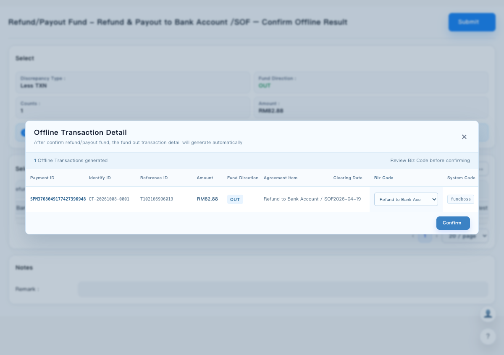

# Offline Transaction Detail for Confirm Offline Result

## Executive Summary

This PRD defines the post-Submit review experience for the `Confirm Offline Result` operation. After a valid refund/payout submission, the system generates one or more fund-out Offline Transaction Detail records. The user reviews the generated batch in a compact light-blue modal, may change only Biz Code, and confirms the batch before the discrepancy operation is completed.

## Version Control

| Version | Description | Date | Editor |
| --- | --- | --- | --- |
| V0.1 | Initial PRD based on the confirmed Confirm Offline Result flow and selected UI Option B | 2026-10-08 | Codex draft |

## Problem Statement

### Current Problem

In the discrepancy handling flow, FinOps users can complete an offline refund or payout through:

`Handling Type > Refund/Payout Fund > Refund & Payout to Bank Account /SOF > Confirm Offline Result`

After the user submits the offline refund/payout result, the system must create a fund-out Offline Transaction Detail. The current experience does not provide a compact, structured review step for the newly generated transaction before the operation is confirmed.

The review step must support batch results because one Submit action may generate more than one Offline Transaction Detail. The system-generated fields should remain protected, while Biz Code must remain adjustable using the existing Biz Code field behavior.

### Pain Points

- Users cannot clearly review the newly generated Offline Transaction Detail after Submit.
- A batch result needs a table format rather than a single-record form.
- Users need to correct Biz Code before confirmation, but other generated fields must not be accidentally changed.
- The old selection-oriented presentation introduced unnecessary checkboxes and `0 records selected` copy even though the system has already generated the records.
- The review modal must fit the existing Discrepancy Details page and remain compact enough for one-glance scanning.

## Goals and Objectives

### Product Objective

Add a post-Submit Offline Transaction Detail review modal for the Confirm Offline Result operation.

The modal must:

1. Show every newly generated fund-out transaction in a batch table.
2. Make the generated fields read-only and keep only Biz Code editable.
3. Allow FinOps users to review or update Biz Code before confirming the operation.
4. Persist the reviewed result only after the user clicks `Confirm`.
5. Use the selected Option B visual direction: compact, batch-oriented, and light blue.

### Success Metrics

The following are proposed launch targets and should be confirmed with PM and Operations before release:

| Metric | Target | Measurement |
| --- | --- | --- |
| Required field completeness | 100% of generated records show all nine required fields | Compare generated transaction payload with rendered modal fields |
| Editability protection | 0 non-Biz Code fields can be modified from the modal | UI interaction test and automated DOM/accessibility audit |
| Confirmation accuracy | At least 98% of confirmed records pass Biz Code validation without rework | Confirmed records versus post-confirm correction cases |
| Batch visibility | 100% of generated records appear in the same review modal before confirmation | Generated record count versus rendered table row count |
| Interaction reliability | At least 99% of eligible Submit actions reach the review modal or a clear error state | Frontend event and API monitoring |

## Scope and Stakeholders

### Scope

| Region / Surface | Scope | Stakeholder |
| --- | --- | --- |
| MY prototype and target workflow | Discrepancy Details page, Confirm Offline Result flow | FinOps, PM, Design, FE, BE |
| Accounting impact | Offline Transaction Detail creation and Biz Code assignment | Accounting / Recon owner, DFR owner |
| User operation | Submit, review generated records, edit Biz Code, Confirm | FinOps operations |

### Stakeholder Responsibilities

| Stakeholder | Responsibility |
| --- | --- |
| FinOps / Operations | Validate field meaning, batch behavior, Biz Code options, and operational copy |
| PM | Confirm scope, success metrics, rollout decision, and open business rules |
| Design | Finalize Option B visual tokens, responsive behavior, and accessibility states |
| FE | Implement modal state, table rendering, field validation, and confirmation interaction |
| BE / Transaction service | Generate Offline Transaction Detail records, return identifiers and source values, persist Biz Code, and expose failure reason |
| Accounting / Recon / DFR | Confirm posting, reconciliation, and downstream record impact |

## User Stories / Use Cases

### Review a Single Generated Transaction

As a FinOps operator,
I want to review the Offline Transaction Detail generated after I submit a Confirm Offline Result,
so that I can verify the system-generated transaction before it is confirmed.

Acceptance Criteria:

- After a valid Submit, the `Offline Transaction Detail` modal is displayed.
- The modal subtitle is exactly: `After confirm refund/payout fund, the fund out transaction detail will generate automatically`.
- The modal shows all nine required fields in the defined order.
- The modal does not show a checkbox, `0 records selected`, or a Payment ID selection step.
- The user can confirm the operation only through the `Confirm` button.

### Review Multiple Generated Transactions

As a FinOps operator,
I want to review multiple generated Offline Transactions in one table,
so that I can validate a batch without opening each transaction separately.

Acceptance Criteria:

- One table row represents one generated Offline Transaction.
- The table row count equals the number of records returned by the generation response.
- A batch summary displays the generated record count.
- All rows use the same field order and editability rules.
- Confirm applies to the reviewed batch after all validation checks pass.

### Correct Biz Code Before Confirmation

As a FinOps operator,
I want to change Biz Code for a generated transaction,
so that the transaction is classified correctly before confirmation and downstream accounting handling.

Acceptance Criteria:

- Biz Code is rendered as the existing Biz Code selector pattern.
- Only Biz Code is editable in the generated transaction modal.
- The UI does not show an `Editable` badge or a separate editable label.
- The selected Biz Code is included in the Confirm request for the corresponding generated record.
- Invalid Biz Code values cannot be confirmed.

### Handle Generation or Confirmation Failure

As a FinOps operator,
I want to receive a clear error when transaction generation or confirmation fails,
so that I know whether to correct the input or retry the operation.

Acceptance Criteria:

- The modal is not presented as successfully generated when the generation request fails.
- The user sees an actionable error message and the original operation form remains available for correction or retry.
- A failed Confirm does not mark the discrepancy as completed.
- The user can distinguish generation failure from Biz Code validation failure and persistence failure.

## Requirement Overview

| Type / Module | Description |
| --- | --- |
| Entry and trigger | Open the generated detail modal after a valid Submit from Confirm Offline Result |
| Modal identity | Use title `Offline Transaction Detail` and the confirmed subtitle copy |
| Batch review | Display all generated records in one compact table with a generated count |
| Generated fields | Display Payment ID, Identify ID, Reference ID, Amount, Fund Direction, Agreement Item, Clearing Date, and System Code as read-only |
| Biz Code | Display Biz Code as the only editable field, using the existing selector and validation |
| Confirm | Confirm all reviewed generated records and persist the final Biz Code values |
| Cancel / close | Close the modal without completing the operation; preserve the appropriate retry or pending state |
| Visual direction | Adopt Option B: light blue, batch-oriented, compact modal with restrained spacing |
| Accounting impact | Create or persist the fund-out Offline Transaction Detail and expose the result to downstream accounting / reconciliation flows |

## Requirement Detail

### Entry Point and Preconditions

| Module / Scenario | Main Logic | UI Page | Acceptance Criteria |
| --- | --- | --- | --- |
| Operation entry | The user selects `Refund/Payout Fund`, then `Refund & Payout to Bank Account /SOF`, then `Confirm Offline Result`. | Discrepancy Details > Handling Type operation flow | The operation path is available only when the existing eligibility rules allow it. |
| Required-field validation | The user completes all required refund/payout fields, including status, refund/payout type, bank account where applicable, destination, destination name, destination number, reason, refund/payout date, and a valid Biz Code. | Confirm Offline Result form | Submit is blocked or returns field-level errors when required values are missing or invalid. |
| Submit trigger | On a valid Submit, the system creates or requests creation of the fund-out Offline Transaction Detail records. | Confirm Offline Result form | The system does not complete the discrepancy before generation and review succeed. |
| Generation response | The response returns every generated record required by the table, including the default Biz Code and `fundboss` System Code. | Post-Submit review modal | The modal opens only after a successful generation response, or a clear generation error is shown. |

### Modal Structure and Visual Direction

| Module / Scenario | Main Logic | UI Page | Acceptance Criteria |
| --- | --- | --- | --- |
| Modal header | Show the title and the fixed explanatory subtitle. Keep the close control in the upper-right corner. | Option B light-blue modal | Title is `Offline Transaction Detail`. Subtitle is exactly `After confirm refund/payout fund, the fund out transaction detail will generate automatically`. |
| Batch summary | Show the number of generated Offline Transactions and a short review reminder. | Option B light-blue modal | The displayed count equals the number of table rows. The summary does not contain selection language. |
| Result table | Use a horizontal table that supports multiple generated records and keeps the modal compact. | Option B light-blue modal | All required columns are visible on desktop. On smaller widths, the table can scroll horizontally without changing column order. |
| Visual treatment | Use a light-blue header, summary strip, table header, and footer. Keep the modal white with restrained borders and a compact shadow. | Option B light-blue modal | The modal visually belongs to the existing Discrepancy Details page and does not become a full-page replacement. |
| Selection controls | The generated records are already created by the system; do not require the user to select a Payment ID again. | Option B light-blue modal | No leading checkbox, select-all control, `Please select the correct Payment ID`, or `0 records selected` is rendered. |
| Screenshot reference | The current approved visual baseline is the Option B light-blue implementation. |  [Open the live prototype](https://catherineliuliu111.github.io/discrepancy-offset-suggestion/discrepancy-details-v2-manual-refund-update.html?from=discrepancy-offset-suggestion) | The implementation remains consistent with the approved baseline while backend values are connected. |

### Generated Transaction Field Rules

| Field | Main Logic / Source | Editable | UI and Validation Rules |
| --- | --- | --- | --- |
| Payment ID | Generated or returned for the corresponding Offline Transaction Detail. | No | Display as a read-only identifier. It must be present and unique within the generated batch. |
| Identify ID | Generated Offline Transaction identifier. | No | Display as a read-only identifier. It must be returned by the generation response. |
| Reference ID | Derived from the source discrepancy, refund/payout result, or related transaction reference. | No | Preserve the source value and display it as read-only. |
| Amount | Derived from the selected discrepancy and confirmed refund/payout result. | No | Preserve currency and amount precision returned by the service. Do not allow manual amount edits in this modal. |
| Fund Direction | Fund-out direction for this flow. | No | Display `OUT` for the generated fund-out transaction. The value is not editable. |
| Agreement Item | Derived from the selected operation and source discrepancy. | No | Display the generated Agreement Item, such as `Refund to Bank Account / SOF`, as read-only. |
| Clearing Date | Derived from the source discrepancy or the confirmed transaction business date according to the agreed service rule. | No | Display the generated date in the existing portal date format. Do not allow manual edits in this modal. |
| Biz Code | Defaulted by the operation / Biz Code rule and reviewable by the operator. | **Yes** | Use the existing Biz Code selector pattern. Only this field can change. Apply the existing Biz Code validation before Confirm; `Others` must not be submitted when it is invalid for this flow. |
| System Code | Default system value for the generated record. | No | Default to `fundboss`. Keep it as the final table column and render it as read-only. |

### Batch Generation and Review Rules

| Scenario | Main Logic | Acceptance Criteria |
| --- | --- | --- |
| One selected discrepancy | Generate one Offline Transaction Detail and show one row. | Summary count is `1`; exactly one row is rendered. |
| Multiple selected discrepancies | Generate one Offline Transaction Detail per eligible selected discrepancy, subject to the service response. | Every returned record is rendered once; records are not merged unless the backend contract explicitly defines aggregation. |
| Partial generation response | Do not silently hide failed records. | The UI either blocks review and shows a generation error, or clearly identifies partial generation and follows an approved retry rule. |
| Default Biz Code | Populate the value returned by the service or the existing operation rule. | The default is visible in every row before Confirm. |
| Biz Code change | Persist the final selected Biz Code by generated record, not only by table position. | A changed value remains associated with the correct Payment ID / Identify ID after sorting or rerendering. |
| Confirm batch | Submit all reviewed generated records together. | Confirm is successful only when every row passes validation and persistence. |

### User Operation and State Rules

| Operation | Trigger | System Behavior | Status Impact | Acceptance Criteria |
| --- | --- | --- | --- | --- |
| Open review modal | Valid Submit returns generated records | Render the generated batch and allow Biz Code review | Discrepancy remains pending until Confirm succeeds | Modal opens with complete data and no selection controls |
| Change Biz Code | User changes one row's Biz Code selector | Update temporary review state for that generated record | No status change | Only the targeted row changes |
| Confirm | User clicks `Confirm` | Validate all rows, persist Biz Code and generated transaction references, then complete the operation | Mark the operation / discrepancy completed only after successful persistence | Modal closes only after success; success state is visible in the parent page |
| Close modal | User clicks `x` | Discard unconfirmed temporary edits and return to the operation context | Do not mark the operation completed | No generated record is treated as confirmed |
| Generation error | Service cannot create or return the records | Show an error with retry or return path | Keep source operation uncompleted | No empty success modal is shown |
| Confirm error | Persistence or validation fails | Keep the modal open, preserve user edits, and show the cause | Keep source operation uncompleted | User can correct Biz Code or retry without losing the batch |

### Accounting and Downstream Impact

| Scenario | Main Logic | Accounting / Recon Expectation | UI Expectation |
| --- | --- | --- | --- |
| Confirmed fund-out transaction | The Confirm Offline Result flow creates or confirms the corresponding Offline Transaction Detail. | The generated transaction is available to the downstream accounting and reconciliation flow defined for the operation. | The modal shows the generated identifiers and `System Code = fundboss`. |
| Biz Code corrected before Confirm | The final Biz Code is sent with the generated transaction confirmation. | Downstream classification uses the confirmed Biz Code, subject to existing Biz Code rules. | The user sees the final selected Biz Code before clicking Confirm. |
| User closes without Confirm | No confirmation persistence occurs. | No completed accounting outcome should be claimed. | The modal closes without a success state. |

The exact posting, Statement Recon, DFR, and journal-entry behavior remains governed by the existing operation/accounting design and must be signed off by the Accounting / Recon owner before production rollout.

## Technical Considerations

### Frontend

- Treat the generated transaction list as a collection, not a single object.
- Keep temporary Biz Code edits keyed by a stable generated-record identifier, preferably Identify ID or Payment ID.
- Render the modal from the generation response rather than reconstructing required values only from visible table rows.
- Keep non-Biz Code controls read-only and prevent accidental keyboard edits.
- Support desktop and narrow viewport behavior with one primary modal scroll area.
- Keep the existing operation completion callback behind a successful Confirm response.

### Backend / API Contract

The generation and confirmation APIs must define:

- Request identity for the selected discrepancy or batch.
- Generated record identity and uniqueness guarantees.
- Source mapping for Payment ID, Identify ID, Reference ID, Amount, Agreement Item, and Clearing Date.
- Default Biz Code and the supported Biz Code option set.
- System Code default and validation; MVP default is `fundboss`.
- Whether generation is synchronous or asynchronous.
- Full failure behavior for zero, partial, duplicate, or retry responses.
- Idempotency behavior when the user retries Submit or Confirm.

### Auditability

- Store the final Biz Code selected at Confirm time.
- Store the relationship between the source discrepancy and generated Offline Transaction Detail.
- Store the operator, timestamp, operation name, and confirmation result.
- Make retry and failure states distinguishable from a completed operation.

## Access Control

- Reuse the existing permission and eligibility checks for `Refund/Payout Fund` and `Confirm Offline Result`.
- Do not expose Confirm Offline Result to users who cannot perform the parent operation.
- Reuse the existing Biz Code permission / validation model; this PRD does not introduce a new Biz Code permission role.
- A user who can open the operation but cannot edit Biz Code must receive the agreed read-only or blocked behavior before launch; this is an open question.

## Rollout Plan

| Phase | Scope | Exit Criteria |
| --- | --- | --- |
| Phase 0: Prototype | Option B light-blue modal in the static Discrepancy Details prototype | PM / Design / FinOps agree on layout, labels, field order, and editability |
| Phase 1: Contract validation | Confirm generation and confirmation API payloads with BE and Accounting / Recon | Field mapping, Biz Code rules, idempotency, and failure states are signed off |
| Phase 2: Internal testing | Enable for test users and representative single/batch cases | All P0/P1 test cases pass; no non-Biz Code edit path exists |
| Phase 3: Controlled rollout | Enable for the agreed region / user group | Monitor generation success, confirmation success, Biz Code correction rate, and error rate |
| Phase 4: General availability | Expand to the approved production scope | Rollout metrics meet targets and no open P0/P1 issues remain |

Rollback: disable the Confirm Offline Result post-Submit generation path or route the user to the existing operation error / retry state without marking the discrepancy completed. Previously confirmed transactions must not be deleted by a UI rollback.

## Test Plan

### Functional Test Cases

- Submit one eligible discrepancy and verify one generated row.
- Submit multiple eligible discrepancies and verify one row per generated record.
- Verify the exact title and subtitle copy.
- Verify the exact column order: Payment ID, Identify ID, Reference ID, Amount, Fund Direction, Agreement Item, Clearing Date, Biz Code, System Code.
- Verify no checkbox, select-all control, `Please select the correct Payment ID`, or `0 records selected` is shown.
- Verify `System Code` is the final column and defaults to `fundboss`.
- Verify each non-Biz Code field is read-only.
- Verify Biz Code can be changed per row and the selected value is preserved through rerendering.
- Verify invalid Biz Code values cannot be confirmed.
- Verify Confirm sends all reviewed rows and closes only after a successful response.
- Verify closing the modal does not complete the operation.
- Verify generation failure, partial response, validation failure, and persistence failure states.
- Verify duplicate Submit / Confirm behavior according to the idempotency contract.

### UI and Accessibility Test Cases

- Verify the light-blue Option B visual hierarchy at desktop width.
- Verify modal content remains usable at narrow viewport widths.
- Verify keyboard focus reaches every Biz Code selector, close control, and Confirm button.
- Verify focus state is visible without relying on color alone.
- Verify long Payment ID, Reference ID, Agreement Item, and Biz Code values do not overlap adjacent columns.
- Verify the generated count equals rendered rows.
- Verify no horizontal scrollbar is introduced inside the modal at the agreed desktop breakpoint; narrow viewport overflow must remain contained in the table region.

## Risks and Mitigations

| Risk | Impact | Mitigation |
| --- | --- | --- |
| Generated transaction response is incomplete | Users confirm a record with missing accounting identifiers | Block review until required fields are present; show a generation error with retry path |
| Biz Code changes are not persisted per record | Incorrect downstream accounting classification | Key edits by stable generated-record ID and verify request payload before Confirm |
| Duplicate generation on retry | Duplicate fund-out transactions | Define server-side idempotency key using source operation / discrepancy IDs |
| Batch response contains partial failures | Some discrepancies appear completed while others are not | Define all-or-nothing versus partial-success behavior before development; do not silently hide failed rows |
| Modal is too wide for real data | Fields overlap or become difficult to scan | Use table overflow protection, representative long-value fixtures, and responsive acceptance tests |
| UI suggests Payment ID selection | Users believe they must select a newly generated record | Remove checkboxes, selection count, and selection-oriented title/copy |
| Biz Code options are inconsistent with the operation form | Confirmed value cannot be accepted downstream | Reuse the same Biz Code source and validation contract as the existing operation form |

## Dependencies and Assumptions

- The parent Confirm Offline Result flow already owns required-field validation for refund/payout status, type, bank details, destination, reason, date, and Biz Code.
- The backend can return a stable generated-record identifier for every Offline Transaction Detail.
- The generated transaction is a fund-out transaction for this flow, so Fund Direction is `OUT`.
- The default System Code is `fundboss` for the MVP.
- Biz Code options and validation can reuse the existing Biz Code field contract.
- The exact Clearing Date source and fallback rule still require service-owner confirmation.
- The exact downstream Statement Recon, DFR, and journal-entry posting behavior is outside this UI-only PRD and must be linked to the approved accounting design.
- The current prototype is a static HTML implementation; production behavior requires API integration, persistence, audit logging, and permission enforcement.

## Open Questions

| Question | Owner | Status |
| --- | --- | --- |
| Is generation synchronous during Submit, or should the modal show an asynchronous processing state? | BE / PM | Open |
| Is the batch Confirm all-or-nothing, or can some generated transactions succeed while others fail? | BE / Accounting | Open |
| What is the idempotency key for repeated Submit and Confirm requests? | BE | Open |
| Which service field is the authoritative source for Identify ID? | BE / Accounting | Open |
| What is the exact Clearing Date rule: source discrepancy date, refund/payout date, or service business date? | Accounting / Recon | Open |
| Should users with operation access but without Biz Code edit permission see a read-only Biz Code value or be blocked from Confirm? | PM / Access Control | Open |
| Are all Biz Code values available in the existing field valid for this generated fund-out transaction, and is `Others` always rejected? | Accounting / Biz Code owner | Open |
| What downstream records are created or updated in Statement Recon and DFR after Confirm? | Accounting / Recon / DFR | Open |
| Which regions and user groups are included in the first production rollout? | PM / Operations | Open |
